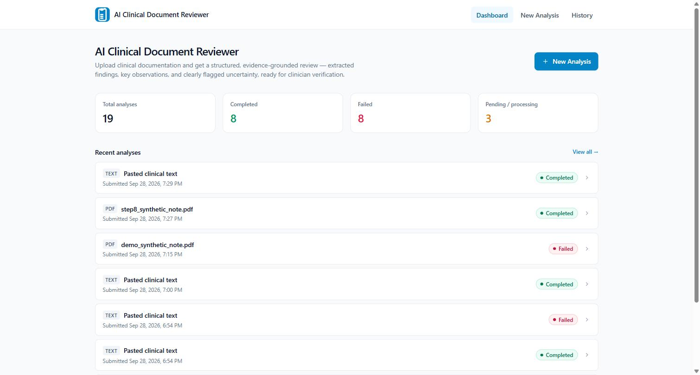
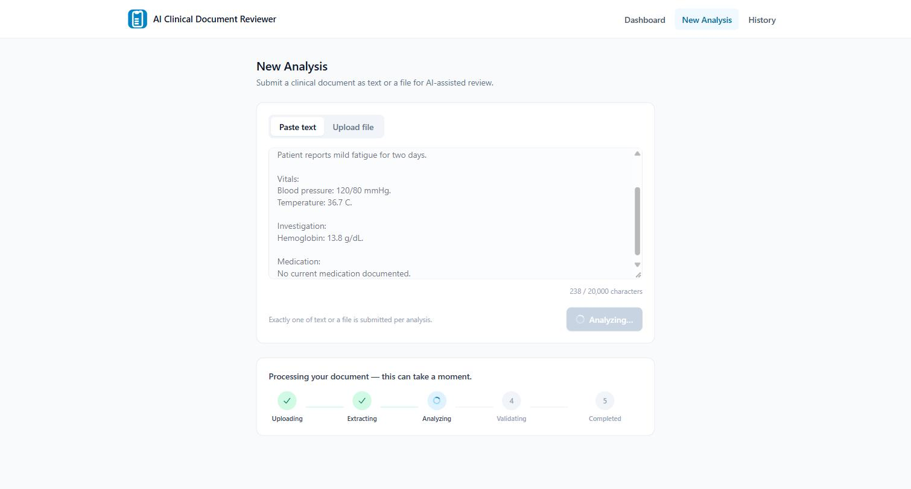
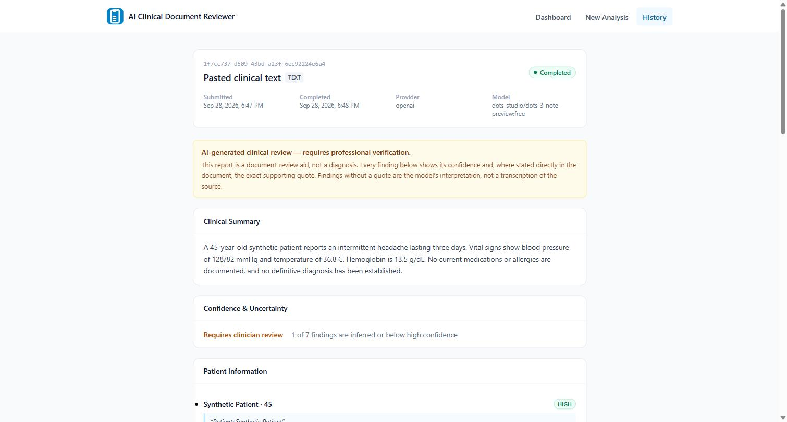
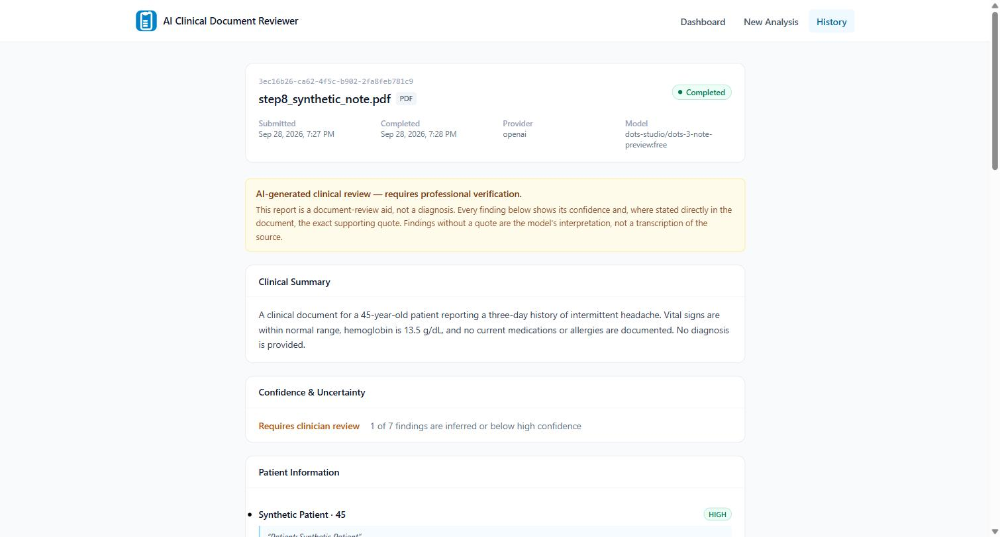
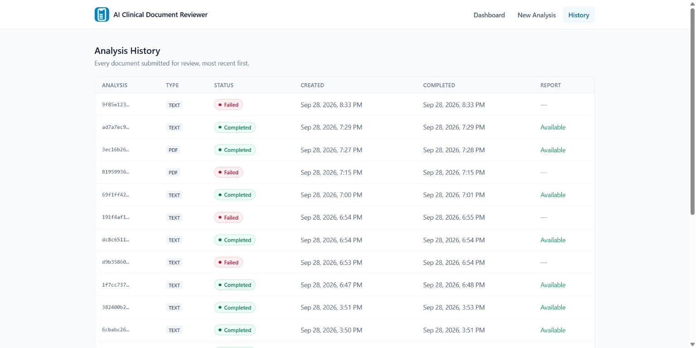
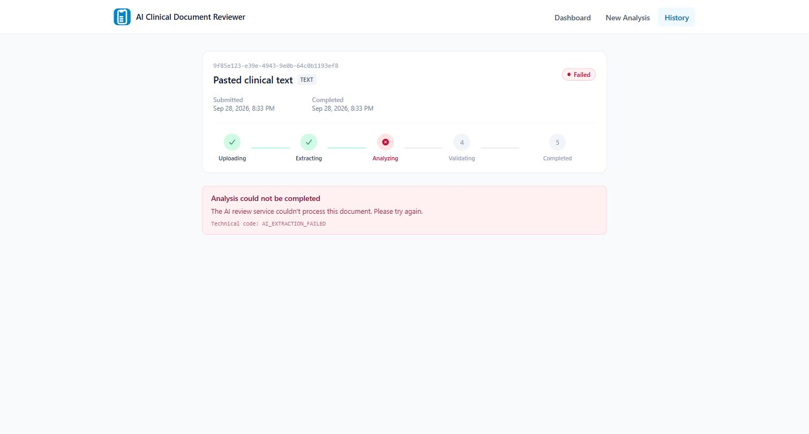

# AI Clinical Document Reviewer

An end-to-end AI/ML application that ingests clinical documentation (plain text or PDF), extracts the relevant clinical information, runs it through an AI-based clinical analysis pipeline, and produces a structured, evidence-grounded clinical report for a reviewer to verify.

## Live Demo

**Live Demo:** <http://100.59.34.97>

The frontend and the API are served through this single public origin — the browser calls the backend at same-origin paths (`/api/...`, `/health`), proxied internally by nginx to the backend service. There is no separate URL to visit for the API.

## Features

**Document ingestion**
- Plain clinical text, pasted directly into the app
- PDF document upload, processed through the same pipeline as pasted text
- The backend's document-processing layer also supports image upload and OCR (local Tesseract) for scanned/handwritten content, covered by the automated test suite

**AI pipeline**
- Clinical information extraction from the processed document text
- Structured clinical analysis via an LLM (extract → generate → validate)
- Evidence-grounded findings — every finding cites a verbatim quote from the source document
- Confidence information on every finding (HIGH/MEDIUM/LOW, plus an inferred-vs-stated flag)
- Structured clinical report generation (summary, patient information, symptoms, diagnoses, medications, vitals, allergies, observations, concerns, missing information, inconsistencies)
- Deterministic (non-LLM) validation that rejects any report whose evidence isn't actually found in the source document, before it's ever shown to a user

**Report**
- Clinical findings grouped by category
- The exact evidence quote behind each finding, shown inline
- Confidence level per finding
- A persistent disclaimer that the report is AI-generated and requires professional verification

**Infrastructure**
- React + TypeScript + Vite (frontend)
- FastAPI (backend)
- PostgreSQL
- Docker Compose
- AWS EC2
- Nginx (production static serving + reverse proxy)
- A provider-agnostic `AIProvider` interface calling any OpenAI-compatible `/chat/completions` endpoint — the live deployment is currently configured against a Gemini model via Gemini's OpenAI-compatible endpoint, with no code change required to point it at a different compatible provider

## Architecture

```
Browser
  ↓
Nginx (production frontend container)
  ↓
React frontend (static build)

/api/*  and  /health
  ↓
Nginx reverse proxy
  ↓
FastAPI backend
  ↓
PostgreSQL

Backend
  ↓
AI provider (OpenAI-compatible endpoint)
```

The production frontend and the API are reached through the same public origin: nginx serves the built React app for `/`, and reverse-proxies `/api/*` and `/health` to the backend container over the internal Docker network — the browser never talks to the backend directly or on a separate port.

Full detail — backend module responsibilities, the REST API contract, the processing-status state machine, database schema, AI/ML interfaces, the structured report contract, and the error-response format — is in [`docs/architecture/system-architecture.md`](docs/architecture/system-architecture.md), with a component diagram at [`docs/architecture/architecture-diagram.mmd`](docs/architecture/architecture-diagram.mmd). The reasoning behind each major technology/design choice is recorded in [`docs/decisions/`](docs/decisions) (ADRs 001–008: frontend, backend, database, AI/ML, storage, deployment, OCR, AI pipeline).

## Screenshots

All screenshots below are from the running application, using synthetic clinical data only.

**Dashboard**


**Analysis pipeline in progress**


**Completed clinical report**


**Completed PDF report**


**Analysis history**


**Failed-analysis error state**


## Testing

- **103 automated backend tests passed** (API validation paths, report schema rules, document-processing/OCR, AI pipeline/validator, real-provider request/response/error handling, and full API-level pipeline integration)
- Frontend production build verified
- Docker Compose configuration verified
- Real end-to-end **text** submission verified against the live deployment, reaching `COMPLETED` with a persisted, retrievable report
- Real end-to-end **PDF** submission verified against the live deployment, reaching `COMPLETED` with a persisted, retrievable report
- Evidence grounding verified — every evidence quote in generated reports checked to be a verbatim match against the source document
- PostgreSQL persistence verified — analyses and their reports confirmed directly in the database, not just via the API

## Deployment

The application is deployed on a single **AWS EC2** instance running the full stack via **Docker Compose**: **PostgreSQL**, the FastAPI backend, and a production **React** build served by **Nginx**. Nginx also reverse-proxies API requests to the backend, so the deployment is reachable through one public URL. Database migrations are applied automatically on backend startup. Configuration (database credentials, AI provider settings, allowed origins) is supplied entirely through environment variables, not hard-coded, so the same container images run locally and in this deployment.

## Limitations

- **HTTP, not HTTPS.** The live deployment is served over plain HTTP at a public IP address, without a custom domain or TLS certificate.
- **No authentication on the API.** Every route is reachable by anyone with the URL — acceptable for this evaluation deployment, but a requirement before any real production use.
- **AI response time and availability depend on the configured provider's free tier.** The AI layer is provider-agnostic, but the currently configured free-tier model can occasionally be slow or briefly unavailable under high demand; the application always fails clearly and honestly in that case (a distinct, human-readable error state) rather than fabricating a result, and a retry typically succeeds.
- **Single-instance deployment**, with uploaded file storage on that instance's own Docker volume rather than external object storage — durable across restarts, not across replacing the instance.

## Synthetic Data / Safety

All clinical examples used by this project — in the repository, in testing, and in the live demo — are synthetic. No real patient data is used anywhere in this project.

## Project Structure

```
ai-clinical-document-reviewer/
├── frontend/              React + TypeScript + Vite client (dashboard, new analysis, history, report views)
│   ├── Dockerfile             Local development image (Vite dev server)
│   ├── Dockerfile.prod        Production image (build + Nginx static/reverse-proxy serving)
│   └── nginx.conf              Nginx config: serves the React build, proxies /api/ and /health to the backend
├── backend/
│   ├── app/
│   │   ├── api/v1/            REST routes (analyses, health)
│   │   ├── core/               config, error taxonomy, DB session, enums
│   │   ├── models/              SQLAlchemy models (documents, analyses, clinical_reports, processing_events)
│   │   ├── schemas/             Pydantic contracts (requests/responses, ClinicalReport)
│   │   ├── services/            use-case orchestration (AnalysisService)
│   │   ├── repositories/        SQLAlchemy persistence per model
│   │   ├── document_processing/ DocumentProcessor: TextProcessor, PDFProcessor, ImageProcessor + OCREngine (Tesseract)
│   │   └── ai/                  AIProvider + ClinicalReportValidator interfaces, ClinicalAnalysisPipeline, deterministic validator, OpenAICompatibleProvider
│   ├── migrations/          Alembic migrations
│   └── tests/               Pytest unit/API tests (103 passing)
├── docs/
│   ├── architecture/          system-architecture.md, architecture-diagram.mmd
│   ├── decisions/              ADRs 001–008
│   ├── screenshots/            Application screenshots (see above)
│   └── testing/                 test strategy
├── synthetic-data/        Synthetic sample clinical documents
├── docker-compose.yml         Local development stack
├── docker-compose.prod.yml    Production stack (Nginx-fronted, single public origin)
└── .github/workflows/     CI (backend tests, frontend build)
```

## Local Development

Prerequisites: Python 3.11+, Node.js 20+, Docker & Docker Compose.

```bash
cp .env.example .env   # set AI_PROVIDER/AI_MODEL_NAME/AI_API_KEY for real AI analysis; leave AI_PROVIDER=placeholder to run without one
docker compose up --build
```

This starts PostgreSQL, the FastAPI backend (migrations run automatically), and the React dev server together. See [`docs/testing/README.md`](docs/testing) for running the backend test suite without Docker or a real OCR engine.

## Future Improvements

- Asynchronous pipeline execution (background worker/job queue) instead of a synchronous request-blocking call
- Production object storage (S3) for uploaded files, replacing the current instance-local volume
- HTTPS with a custom domain, and basic API authentication
- Multi-instance/load-balanced deployment
- Broader integration and end-to-end test coverage beyond the backend's unit/API suite

## License

MIT — see [LICENSE](LICENSE).
