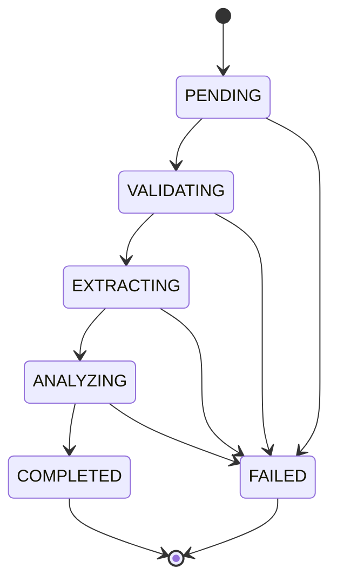
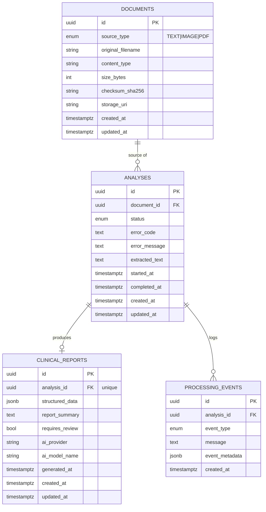

# System Architecture

> Status: architecture and engineering contracts only. See [README.md](../../README.md#roadmap) for what is and isn't implemented yet. Nothing in this document describes clinical document processing or AI analysis logic that actually exists — those are interfaces/contracts to be implemented next.

## 1. Overview

```
User → React frontend → FastAPI backend → document processing (OCR/text extraction)
     → AI/ML pipeline → structured clinical report → PostgreSQL persistence
```

The system accepts a clinical document as **plain text**, an **image** (scanned or handwritten), or a **PDF** (typed, scanned, or handwritten pages), extracts its text, runs it through an AI/ML pipeline, and produces a structured clinical report. Every step, and every previous report, is persisted and retrievable.

See [`architecture-diagram.mmd`](architecture-diagram.mmd) for the full component diagram (Frontend, Backend/API, Document Processing, OCR, AI/ML, PostgreSQL, Object Storage, External AI service).

Two hard boundaries shape the whole design:

1. **Frontend and backend are fully separate** — the frontend only ever talks to the backend over the versioned REST contract in [§3](#3-api-contract). No shared code, no server-rendering coupling.
2. **The AI/ML layer is provider-agnostic** — `app/ai` exposes interfaces only (no LLM provider selected or called anywhere), and `app/document_processing`'s one concrete OCR engine (local, offline Tesseract — see [007-ocr.md](../decisions/007-ocr.md)) sits behind an `OCREngine` interface ([§6](#6-aiml-architecture)); no OpenAI/Anthropic/Gemini-specific code exists in business logic anywhere, and even the OCR engine choice is swappable without touching `ImageProcessor`/`PDFProcessor`. Swapping a provider means adding one new implementation class, never touching `app/api` or `app/services`.

## 2. Backend Architecture

`backend/app/` is layered so each module has exactly one reason to change:

| Module | Owns | Must NOT own |
|---|---|---|
| `api/` | HTTP routing, request parsing (`Form`/`File`/`Query`), response shaping via `schemas/`, status codes, OpenAPI docs | Business rules, SQL, any file/AI processing |
| `core/` | Cross-cutting infrastructure: settings (`config.py`), the error taxonomy (`exceptions.py`), exception→HTTP mapping (`error_handlers.py`), DB engine/session (`database.py`), enums shared by models+schemas (`enums.py`) | Request handling, domain logic specific to one feature |
| `models/` | SQLAlchemy ORM table definitions, relationships, constraints | Validation of external input (that's `schemas/`), business rules |
| `schemas/` | Pydantic request/response contracts, the `ClinicalReport` structured-output contract, the error envelope | Persistence, HTTP status codes, business logic |
| `services/` | Use-case orchestration (`AnalysisService`): input validation, coordinating `repositories/`, `document_processing/`, and `ai/` to move an analysis through its lifecycle | HTTP concerns, raw SQL, provider-specific extraction/AI code |
| `repositories/` | Translating between domain objects and SQL rows/queries via SQLAlchemy `Session` | Business rules (e.g. which status transitions are legal), request/response shaping |
| `document_processing/` | Turning raw bytes into normalized text: the `DocumentProcessor` interface (`TextProcessor`, `PDFProcessor`, `ImageProcessor`) and the `OCREngine` interface it depends on for scanned/image content (one implementation: local Tesseract) | HTTP, persistence, clinical interpretation, any specific OCR/LLM vendor |
| `ai/` | The `AIProvider`/`ClinicalReportValidator` interfaces, the EXTRACT→GENERATE→VALIDATE pipeline orchestrator, the one deterministic validator, and the one (deliberately non-functional) placeholder provider | HTTP, persistence, OCR/text extraction, any specific LLM vendor |
| `main.py` | FastAPI app construction: middleware, exception handler registration, router mounting | Route logic, business logic |

Dependency direction is one-way: `api` → `services` → (`repositories` + `document_processing` + `ai`) → `models`/`core`. Nothing below `services` may import from `api`.

## 3. API Contract

Base path: `/api/v1`. Unversioned `GET /health` remains outside the version prefix as an infrastructure-level liveness check, not a business endpoint.

All error responses share one envelope (see [§9](#9-error-architecture)); all endpoints are implemented in `backend/app/api/v1/analyses.py` and validated by `backend/app/schemas/`.

### `GET /health`
Liveness check. `200 { "status": "ok" }`. No auth, no DB dependency.

### `POST /api/v1/analyses`
Submit a document for analysis. **`multipart/form-data`**, not JSON, because it must accept either free text or a binary file in the same endpoint.

| Field | Type | Required | Notes |
|---|---|---|---|
| `text` | string (form field) | exactly one of `text`/`file` | Plain-text clinical content |
| `file` | file upload | exactly one of `text`/`file` | `application/pdf`, `image/png`, `image/jpeg`, `image/tiff`, `image/bmp`, `image/webp` |

Validation (enforced in `AnalysisService`, `backend/app/services/analysis_service.py`):
- Neither provided → `400 EMPTY_INPUT`
- Both provided → `400 VALIDATION_FAILED`
- Empty string / empty file → `400 EMPTY_INPUT`
- Unrecognized `file.content_type` → `415 UNSUPPORTED_FILE_TYPE`
- File larger than `UPLOAD_MAX_SIZE_MB` (see `.env.example`) → `413 FILE_TOO_LARGE`

Response: `201 Created`, body `AnalysisResponse` (see `backend/app/schemas/analysis.py`), `status: "PENDING"`.

### `GET /api/v1/analyses`
List analyses, most recent first.

Query params: `page` (default 1), `page_size` (default 20, max 100), `status` (optional `AnalysisStatus` filter).

Response: `200`, body `Page<AnalysisResponse>` — `{ items: AnalysisResponse[], pagination: { page, page_size, total_items, total_pages } }`.

### `GET /api/v1/analyses/{analysis_id}`
Response: `200` with `AnalysisResponse`, or `404 NOT_FOUND` if the id doesn't exist.

### `GET /api/v1/analyses/{analysis_id}/report`
Response: `200` with `ClinicalReportResponse` (wraps the `ClinicalReport` contract from [§7](#7-aiml-report-contract)); `404 NOT_FOUND` if the analysis doesn't exist; **`409 REPORT_NOT_READY`** if the analysis exists but `status != COMPLETED`.

### `AnalysisResponse` shape

```jsonc
{
  "id": "uuid",
  "status": "PENDING | VALIDATING | EXTRACTING | ANALYZING | COMPLETED | FAILED",
  "document": { "id": "uuid", "source_type": "TEXT | IMAGE | PDF", "original_filename": "string|null", "content_type": "string|null", "size_bytes": 0, "created_at": "iso8601" },
  "error_code": "string|null",
  "error_message": "string|null",
  "report_available": true,
  "created_at": "iso8601",
  "updated_at": "iso8601",
  "started_at": "iso8601|null",
  "completed_at": "iso8601|null"
}
```

## 4. Processing Lifecycle

```
PENDING → VALIDATING → EXTRACTING → ANALYZING → COMPLETED
   ↓            ↓            ↓            ↓
   └────────────┴────────────┴────────────┴──→ FAILED
```



- **PENDING** — analysis record created and persisted; not yet picked up for processing.
- **VALIDATING** — confirming the stored document is readable/well-formed (distinct from the request-level validation in §3, which happens before an Analysis row even exists).
- **EXTRACTING** — the `DocumentProcessor` for the document's `source_type` (`app/document_processing/factory.py::get_processor`) runs to produce a `NormalizedDocument`.
- **ANALYZING** — the AI/ML pipeline runs against the normalized text: EXTRACT (`AIProvider.extract`) → GENERATE (`AIProvider.generate`) → VALIDATE (`ClinicalReportValidator.validate`, deterministic, non-LLM). All three sub-stages happen within this one `AnalysisStatus`; they are not separate top-level statuses (see `app.ai.pipeline.ClinicalAnalysisPipeline` and [008-ai-pipeline.md](../decisions/008-ai-pipeline.md) — the ProcessingEvent audit trail distinguishes them via `event_metadata`, not new enum values).
- **COMPLETED** — a validated `ClinicalReport` has been persisted; terminal.
- **FAILED** — terminal; `Analysis.error_code`/`error_message` are set. Reachable from any non-terminal state.

`COMPLETED` and `FAILED` have no outgoing transitions. The allow-listed transition table lives in `app/core/enums.py::ANALYSIS_STATUS_TRANSITIONS`, and `AnalysisService.run_pipeline()` validates every transition against it before applying one.

Every transition is recorded as an immutable `ProcessingEvent` row — the audit trail is additive, `Analysis.status` is the current-state pointer. `run_pipeline()` is now a complete, real implementation driving PENDING all the way to COMPLETED/FAILED (previous phases implemented only the initial `PENDING` + `STATUS_CHANGED` event, created at `POST /analyses` time). It is not yet called by any API endpoint — see §6 "Provider Status" and [008-ai-pipeline.md](../decisions/008-ai-pipeline.md) design decision 6 for why (no async job infrastructure exists yet to avoid blocking the request on OCR + an AI provider call) — but it is directly callable and is exercised end-to-end by `backend/tests/ai/test_analysis_service_pipeline.py`.

## 5. Database Design

PostgreSQL, accessed exclusively through SQLAlchemy models (`backend/app/models/`) and versioned via Alembic (`backend/migrations/`, initial revision `0001_initial_schema.py`).



Design notes:

- **Primary keys**: UUID (`sa.Uuid`, `default=uuid.uuid4`, client-generated) on every table, including `processing_events` — deliberately *not* an auto-incrementing integer, for portability (see the SQLite-autoincrement pitfall documented in `app/models/processing_event.py`'s history) and so ids are safe to hand to clients/logs before a transaction commits.
- **Foreign keys**: `analyses.document_id → documents.id` (`ON DELETE RESTRICT` — a document with analyses can't be silently deleted); `clinical_reports.analysis_id → analyses.id` and `processing_events.analysis_id → analyses.id` (`ON DELETE CASCADE` — both are owned by, and meaningless without, their analysis).
- **Constraints**: `clinical_reports.analysis_id` is `UNIQUE` (one report per analysis, enforced at the DB level, not just by convention).
- **Indexes**: `documents.checksum_sha256` (future dedup lookups), `analyses.document_id`, `analyses.status` (status-filtered listing), `analyses.created_at` (default sort), `processing_events.analysis_id`, `processing_events.created_at`.
- **JSONB**: `clinical_reports.structured_data` (the full serialized `ClinicalReport` payload — see §7 on why this is JSONB rather than normalized columns) and `processing_events.event_metadata` (free-form, event-type-dependent context). Both use `sa.JSON().with_variant(postgresql.JSONB(), "postgresql")` — native `JSONB` in Postgres, plain `JSON` on other dialects — so the identical models/migration-derived schema also runs against SQLite in fast unit tests without a running Postgres instance (see `backend/tests/conftest.py`).
- **Enums**: stored as `VARCHAR` with `native_enum=False` rather than native Postgres `ENUM` types, so adding a new status/event type is a plain migration rather than an `ALTER TYPE` dance, and the same schema works across dialects for testing.
- **Timestamps**: `created_at`/`updated_at` (`TIMESTAMPTZ`, `server_default=now()`) on every table except `processing_events`, which is append-only and so has `created_at` only — there is nothing to "update".
- **Report data duplication is deliberate**: `clinical_reports.report_summary` and `.requires_review` are promoted copies of fields also present inside `structured_data`, kept solely so they can be filtered/displayed without deserializing JSONB. The JSONB blob remains the single source of truth for reconstructing a `ClinicalReport`.

## 6. AI/ML Architecture

Neither `app/document_processing/interfaces.py` nor `app/ai/interfaces.py` import FastAPI, SQLAlchemy, or any provider SDK — they are pure Python `ABC`s so `AnalysisService` can depend on a contract, never a vendor. Both `document_processing` (including OCR) and the `ai` pipeline's contracts/orchestration are now fully implemented; the one thing still missing is a **working** `AIProvider` — see "Provider Status" below.

```
raw bytes ──(document_processing, incl. OCR)──► NormalizedDocument
    ──(EXTRACT: AIProvider.extract)──► ExtractionResult
    ──(GENERATE: AIProvider.generate)──► draft report (dict)
    ──(VALIDATE: ClinicalReportValidator.validate, deterministic)──► ValidationResult{ClinicalReport}
```

| Interface | Module | Input → Output | Failure mode |
|---|---|---|---|
| `DocumentProcessor` (`TextProcessor`, `PDFProcessor`, `ImageProcessor`) | `document_processing` | raw bytes → `NormalizedDocument` | `EmptyInputError`, `CorruptedFileError`, `OCRFailedError` |
| `OCREngine` (one implementation: `TesseractOCREngine`) | `document_processing` | image bytes → `OCRResult` | `OCRFailedError` |
| `AIProvider` (one implementation: `UnconfiguredAIProvider`) | `ai` | `NormalizedDocument` → `ExtractionResult`; `ExtractionResult` → draft report (`dict`) | `AIExtractionFailedError`, `AIGenerationFailedError` |
| `ClinicalReportValidator` (one implementation: `DeterministicClinicalReportValidator`) | `ai` | draft report + `ExtractionResult` + source text → `ValidationResult` | never raises — see "Deterministic Validation" below |

`document_processing/factory.py::get_processor` dispatches on `DocumentSourceType` to the right `DocumentProcessor`, wiring in `ocr_tesseract.py::get_default_ocr_engine()` (reads `Settings.ocr_engine`) for `PDFProcessor`/`ImageProcessor`. `ai/factory.py::get_default_ai_provider()`/`get_default_validator()` do the analogous thing for the AI stage, reading `Settings.ai_provider`. `app.ai.pipeline.ClinicalAnalysisPipeline` sequences EXTRACT → GENERATE → VALIDATE and is what `AnalysisService.run_pipeline()` calls — see §8 and [008-ai-pipeline.md](../decisions/008-ai-pipeline.md) for the full design, including why validation is a separate interface from generation rather than a third `AIProvider` method.

**Provider status**: `AI_PROVIDER=placeholder` (the shipped default) resolves to `UnconfiguredAIProvider`, which raises a clear, typed error on every call rather than fabricating output. `AI_PROVIDER=openai` selects a real implementation, `OpenAICompatibleProvider` (`app/ai/providers/openai_compatible.py`) — a plain `httpx` call to any OpenAI-compatible `/chat/completions` endpoint (OpenAI itself by default; `AI_API_BASE_URL` to point elsewhere), configured entirely via `AI_PROVIDER`/`AI_MODEL_NAME`/`AI_API_KEY`/`AI_API_BASE_URL` env vars, no credentials in code. `POST /api/v1/analyses` now calls `AnalysisService.run_pipeline()` synchronously, so with a real key configured the endpoint performs real extraction/generation; without one, it fails cleanly with `AI_EXTRACTION_FAILED` rather than fabricating a report. See `docs/decisions/008-ai-pipeline.md` "Real Provider (Step 2)".

Contracts and orchestration for the `ai` pipeline live in `backend/app/ai/`, not the top-level `ml/` directory the original architecture sketch (ADR-004) anticipated — `ml/` is not on the backend's Python import path and is outside the backend Docker image's build context; see [008-ai-pipeline.md](../decisions/008-ai-pipeline.md) "Design Decisions That Need Review" #3 for the full reasoning and what would need to change to use it for real.

### Pipeline Orchestration

`app.ai.pipeline.ClinicalAnalysisPipeline.run(document)` — called by `AnalysisService.run_pipeline()` (§4) — always runs, in order: EXTRACT, a lightweight evidence-grounding check on the extraction itself (catches a hallucinating extractor before spending a GENERATE call on it; raises `EvidenceMismatchError` if any extracted fact cites a quote absent from the source text), GENERATE, then VALIDATE. There is no code path that returns a result without calling the validator — enforced by construction (the method has one `return`, after the validate call) and confirmed by a test using a call-counting wrapper around the real validator.

### Deterministic Validation

`DeterministicClinicalReportValidator` is pure Python — no LLM call, no network — and never raises; it always returns a `ValidationResult` (`VALID`/`INVALID` + a list of issues), converting even a totally malformed draft into an `INVALID` result rather than crashing the pipeline. It checks: (1) the draft actually satisfies the `ClinicalReport` schema (including that schema's own existing "non-inferred finding needs evidence" and "requires_review" rules); (2) every finding's evidence quote is a verbatim substring of the source document (`EVIDENCE_NOT_GROUNDED`) — the concrete mechanism behind "a claim must be traceable to the document, not fabricated"; (3) extraction-flagged missing information isn't silently dropped from the report (`MISSING_INFORMATION_NOT_REPRESENTED`, a warning); (4) a finding doesn't claim higher confidence than the extracted fact backing it (`CONFIDENCE_NOT_PRESERVED`, a warning). Only schema-invalidity and ungrounded evidence are `ERROR`-severity (they make the result `INVALID`); the other two are `WARNING`-severity — recorded, but don't by themselves block a report. Full checklist mapping: [008-ai-pipeline.md](../decisions/008-ai-pipeline.md) "Deterministic Validation".

The validator is a completely separate class hierarchy from `AIProvider` — it is never given a chance to be *the same provider grading its own output*, and it is constructed independently (`ai/factory.py::get_default_validator()`) regardless of which `AIProvider` is configured.

## 7. AI/ML Report Contract

Defined once, in `backend/app/schemas/clinical_report.py`, and mirrored by hand in `frontend/src/types/clinicalReport.ts`.

Top-level `ClinicalReport` fields: `report_summary`, `patient_information`, `symptoms`, `diagnoses`, `medications`, `vitals`, `allergies`, `clinical_observations`, `clinical_concerns`, `missing_information`, `potential_inconsistencies`, `requires_review`.

**Design principle — don't make unsupported information appear factual.** Every clinical finding (`patient_information`, and each entry in `symptoms`/`diagnoses`/`medications`/`vitals`/`allergies`/`clinical_observations`/`clinical_concerns`) is a `SourcedFinding`:

```python
class SourcedFinding(BaseModel):
    confidence: ConfidenceLevel        # HIGH | MEDIUM | LOW
    evidence: list[EvidenceSpan]       # verbatim quotes from extracted_text
    inferred: bool                     # True = summarized/interpreted, not quoted
```

Enforcement, not just convention:
- A finding with `inferred=False` **must** cite at least one `EvidenceSpan` (a verbatim quote) — a Pydantic validator rejects a non-inferred finding with no evidence. You cannot claim "this is what the document says" without pointing at where it says it.
- `requires_review` **cannot** be `False` while any finding is non-`HIGH` confidence or `inferred=True`, or while `missing_information`/`potential_inconsistencies` is non-empty — enforced by a model validator, not left to the generator's discretion. A human clinician must review AI output before any clinical use; the schema makes it structurally impossible to mark a report as not-needing-review while it contains anything uncertain.
- `missing_information` and `potential_inconsistencies` are first-class fields, not an afterthought — an extraction that found nothing for an expected field, or that found two contradictory statements, must say so explicitly rather than silently omitting it.

The frontend is expected to render `inferred`/non-`HIGH` content visibly differently (e.g. a badge or muted styling) from directly-quoted, high-confidence content — this is noted as a hard requirement in the TypeScript types' doc comment, not yet implemented in any UI.

## 8. Document-Processing Architecture

```
TXT   → TextProcessor ─────────────────────────────────────────► NormalizedDocument
PDF   → PDFProcessor  → native text (pypdf), per page
                          │
                          ├─ page has usable text ─────────────► kept as-is
                          └─ page has none ─► OCREngine.recognize(page image) ─► NormalizedDocument
IMAGE → ImageProcessor → OCREngine.recognize(image) ───────────► NormalizedDocument
```

`app/document_processing/interfaces.py` defines `DocumentProcessor` (one method: `process(raw_bytes) -> NormalizedDocument`), the `NormalizedDocument`/`ExtractionWarning`/`ExtractionConfidence` models every implementation shares, and — new this phase — `OCREngine` (one method: `recognize(image_bytes) -> OCRResult`) and `OCRResult`. `factory.py::get_processor(source_type)` dispatches to the right processor, wiring `PDFProcessor`/`ImageProcessor` with `ocr_tesseract.py::get_default_ocr_engine()`:

- **TEXT** (`text_processor.TextProcessor`) — unchanged: decodes UTF-8, normalizes whitespace, no OCR involved.
- **PDF** (`pdf_processor.PDFProcessor`) — for each page, native text (via `pypdf`) is used if present; only a page with **no** native text is routed to OCR, via that page's embedded image (`page.images`, already part of `pypdf` — no separate PDF-rendering library needed, verified against a synthetic scanned-style PDF). Native and OCR'd pages are combined in original page order regardless of source. `PDFProcessor(ocr_engine=None)` (the default when constructed directly, e.g. in tests) preserves the pre-OCR behavior exactly — a page with no native text is just flagged, never sent anywhere; `factory.get_processor(PDF)` always supplies the real engine, so OCR fallback is what actually runs in practice.
- **IMAGE** (`image_processor.ImageProcessor`) — now fully implemented: validates the image (Pillow decode; unreadable/unsupported → `CorruptedFileError`, never a raw Pillow exception), applies the pre-OCR quality heuristic (`image_quality.py`), calls the injected `OCREngine`, normalizes the result. Unlike `PDFProcessor`, there is no native-text fallback — an `OCREngine` failure here propagates as `OCRFailedError` rather than becoming a warning, since there's nothing left to degrade to.

### OCR Architecture

One engine implementation exists: `ocr_tesseract.py::TesseractOCREngine`, wrapping the local, offline Tesseract binary via `pytesseract` — no network call, nothing leaves the machine. See [`docs/decisions/007-ocr.md`](../decisions/007-ocr.md) for the full comparison against EasyOCR/PaddleOCR/docTR/TrOCR/cloud OCR and why Tesseract was chosen (dependency size, zero external service, trivial Docker/Linux install, deterministic testability). `ImageProcessor`/`PDFProcessor` depend only on the `OCREngine` interface — swapping engines is a one-class change plus a `Settings.ocr_engine` value, never a change to either processor.

**Scanned-PDF support — what's actually covered.** `PDFProcessor`'s OCR fallback works by extracting each textless page's embedded raster image(s) via `pypdf`'s `page.images` (no separate PDF-rendering dependency — see [007-ocr.md](../decisions/007-ocr.md) "Alternatives"). This is **not** a general PDF-rendering engine, and does not guarantee results for every possible scanned PDF:

- **Covered**: the dominant real-world case — a page whose scan is one or more raster image XObjects placed directly on the page (including one level of nesting inside a Form XObject, as produced by common PDF-generation tools) — with or without a page-level `/Rotate` value.
- **Page rotation is corrected**: a PDF page's `/Rotate` attribute (always a multiple of 90°) is a *display* instruction that `page.images` does **not** apply to the raw bytes it returns — verified empirically: an uncorrected sideways scan OCR'd as garbled, low-confidence text against the real Tesseract engine, and rotating the extracted image by exactly `page.rotation` degrees (`Image.rotate(page.rotation, expand=True)` — not the seemingly more intuitive negated value; confirmed by testing both directions) fixed it. `PDFProcessor._ocr_page` applies this correction before every OCR call.
- **Not covered**: text rendered as vector paths rather than a raster image (there's no image to extract at all — falls through to the ordinary "no text found" path, not a crash, just no OCR possible); a scan that is skewed/crooked at the pixel level independent of any page-level `/Rotate` (not detected or corrected — this is a genuine, undocumented-elsewhere limitation, not silently pretended away); multiple embedded images per page are all OCR'd and concatenated with no scan-region detection, so an incidental small image (e.g. a logo) contributes whatever (likely empty or noisy) text Tesseract finds in it.
- **Future replacement path**: `PDFProcessor` only ever hands `OCREngine.recognize(image_bytes: bytes)` a plain image — replacing *how that image is obtained* (e.g. swapping `page.images` for a full page-rendering library like PyMuPDF or `pdf2image`, which would also resolve the vector-text and pixel-skew gaps above) requires changing only `PDFProcessor._ocr_page`'s internals. `OCREngine` and `ImageProcessor` are unaffected either way.

**Confidence**: Tesseract reports a real per-word 0-100 confidence score; `_bucket_confidence` deterministically averages and buckets it into the existing qualitative `ExtractionConfidence` model (`HIGH` ≥ 80, `MEDIUM` ≥ 50, else `LOW`; `None` when nothing was recognized) — no confidence number is invented, and no second numeric field was added to `NormalizedDocument`.

**Partial extraction is never silently reported as fully reliable.** `NormalizedDocument.confidence` at the whole-document level answers one specific, coarse question — "did every page end up with *some* text?" (`HIGH` if yes, `MEDIUM` if some pages have none, `None` if none do) — it is **not** an aggregate of every page's individual OCR quality. A document where every page produced *some* text, but one page's OCR was itself low-confidence (or failed and recovered nothing, or hit `IMAGE_QUALITY_LOW`), still surfaces that fact — just via `warnings` (`OCR_LOW_CONFIDENCE`, `OCR_FAILED`, `IMAGE_QUALITY_LOW`), not by further downgrading the top-level `confidence` enum. A caller must read `confidence` **and** `warnings` **and** `requires_ocr` together; none of the three in isolation claims the extraction is complete or reliable on its own.

**Handwriting**: Tesseract is a printed-text engine; handwriting accuracy is not reliable and is not claimed as supported. Every non-empty OCR result carries `HANDWRITING_MAY_REQUIRE_SPECIALIZED_MODEL` — an honest, permanent disclaimer of *this engine's* limitation (there is no handwriting-vs-printed detection), attached by the engine itself so a future handwriting-capable `OCREngine` simply wouldn't emit it.

**Warnings** (`ExtractionWarning.code`), only ever emitted when the implementation actually justifies them:

| Code | Emitted by | Meaning |
|---|---|---|
| `OCR_USED` | `ImageProcessor`, `PDFProcessor` | This text came from OCR, not (for a PDF page) a native text layer — provenance, not a problem. |
| `OCR_LOW_CONFIDENCE` | `TesseractOCREngine` | The engine's own average per-word confidence bucketed to `LOW`. |
| `IMAGE_QUALITY_LOW` | `image_quality.py` (used by both processors) | Image is below a documented minimum pixel-dimension threshold — assessed *before* OCR runs, independent of the engine's confidence. |
| `PAGE_HAS_NO_TEXT` | `PDFProcessor`, `ImageProcessor` | No text found on this page/image, native or OCR. |
| `OCR_FAILED` | `PDFProcessor` (per page, as a warning) | OCR failed for one page of a multi-page PDF — does not abort the rest of the document, unlike `ImageProcessor`, where the same failure has no page to fall back to and raises `OCRFailedError` instead. |
| `NO_EXTRACTABLE_TEXT` | `PDFProcessor` | No page in the whole document yielded any text, native or OCR. |
| `HANDWRITING_MAY_REQUIRE_SPECIALIZED_MODEL` | `TesseractOCREngine` | See "Handwriting" above. |

The document-processing layer has zero FastAPI/SQLAlchemy imports (see interface module docstrings) and makes no LLM/AI provider call. It is fully implemented and unit-tested (`backend/tests/document_processing/`, `FakeOCREngine` standing in for the real engine — see `docs/testing/README.md`). `AnalysisService.run_pipeline()` (§4) now calls it for real, though currently only for **TEXT** analyses — reconstructing a `NormalizedDocument` for PDF/IMAGE requires the original file bytes, which are not yet persisted (see §4's `DocumentBytesUnavailableError` note and [008-ai-pipeline.md](../decisions/008-ai-pipeline.md) design decision 7).

## 9. Error Architecture

Every failed request returns the same envelope (`app/schemas/common.py::ErrorResponse`, built by `app/core/error_handlers.py`):

```jsonc
{
  "error": {
    "code": "UNSUPPORTED_FILE_TYPE",
    "message": "human-readable description",
    "details": { "...": "optional structured context" },
    "request_id": "uuid, echoed from/into X-Request-Id"
  }
}
```

| Scenario | Error code | HTTP status |
|---|---|---|
| Empty input (`open scenario` — neither text nor file provided; empty string/empty file) | `EMPTY_INPUT` | 400 |
| Malformed request (both `text` and `file` provided; schema validation failure) | `VALIDATION_FAILED` | 400 |
| Unsupported file | `UNSUPPORTED_FILE_TYPE` | 415 |
| File exceeds size limit | `FILE_TOO_LARGE` | 413 |
| Corrupted file (bytes don't parse as declared type) | `CORRUPTED_FILE` | 422 |
| Resource not found | `NOT_FOUND` | 404 |
| Report requested before `COMPLETED` | `REPORT_NOT_READY` | 409 |
| Text/PDF extraction failure | `EXTRACTION_FAILED` | 422 |
| OCR failure | `OCR_FAILED` | 422 |
| Document bytes needed for (re-)processing were never persisted | `DOCUMENT_BYTES_UNAVAILABLE` | 422 |
| AI provider failure, unspecified (base class — see the two below) | `AI_PROCESSING_FAILED` | 502 |
| AI provider failure during EXTRACT | `AI_EXTRACTION_FAILED` | 502 |
| AI provider failure during GENERATE | `AI_GENERATION_FAILED` | 502 |
| Extracted fact cites evidence absent from the source document | `EVIDENCE_MISMATCH` | 422 |
| Generated report failed deterministic validation | `REPORT_VALIDATION_FAILED` | 422 |
| No usable AI provider configured | `UNSUPPORTED_AI_PROVIDER` | 501 |
| Database write failure | `PERSISTENCE_FAILED` | 500 |
| Required external service unavailable | `EXTERNAL_SERVICE_FAILED` | 503 |
| Anything else unhandled | `INTERNAL_ERROR` | 500 |

All of the above are `AppError` subclasses in `app/core/exceptions.py`; business logic raises the specific subclass, and `register_exception_handlers` (installed once in `main.py`) is the only place that translates an exception into an HTTP response — route handlers never construct error JSON by hand. `RequestValidationError` (FastAPI/Pydantic-level) and any uncaught `Exception` are also caught centrally and forced into the same envelope so the frontend only ever has to parse one error shape.

## 10. Frontend Contract

`frontend/src/types/api.ts` and `frontend/src/types/clinicalReport.ts` are hand-maintained TypeScript mirrors of `backend/app/schemas/{analysis,document,common,clinical_report}.py`. They are kept in sync manually for now; introducing OpenAPI-schema codegen is a tracked follow-up (`docs/decisions/002-backend.md`). No UI is built against them yet — see the README roadmap.

## 11. Cross-References

- Diagram source: [`architecture-diagram.mmd`](architecture-diagram.mmd)
- Technical decision records: [`../decisions/`](../decisions)
- Structured report schema: `backend/app/schemas/clinical_report.py`
- AI/ML pipeline contracts: `backend/app/ai/schemas.py`, `backend/app/ai/interfaces.py`
- Pipeline orchestrator: `backend/app/ai/pipeline.py`
- Processing status enum & transition table: `backend/app/core/enums.py`
- Initial migration: `backend/migrations/versions/0001_initial_schema.py`
