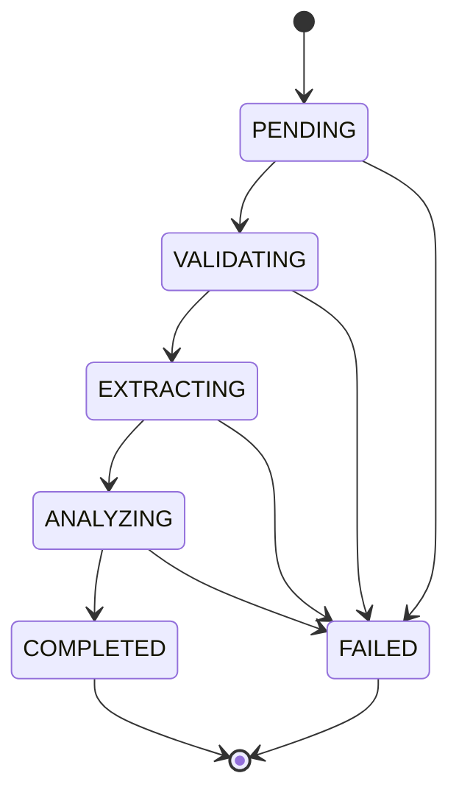
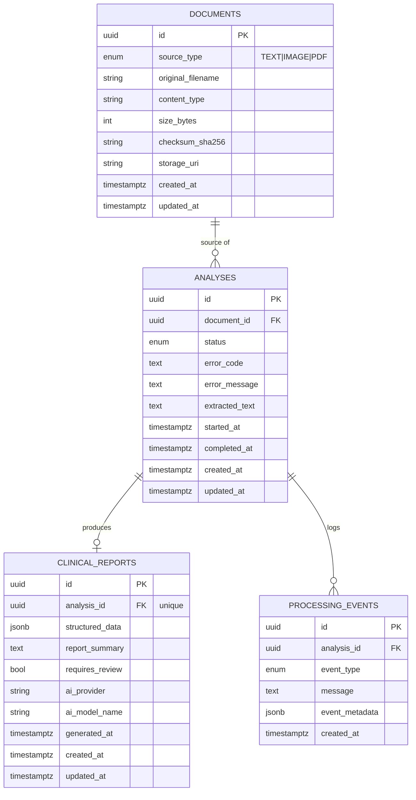

# System Architecture

> Status: architecture and engineering contracts only. See [README.md](../../README.md#roadmap) for what is and isn't implemented yet. Nothing in this document describes clinical document processing or AI analysis logic that actually exists — those are interfaces/contracts to be implemented next.

## 1. Overview

```
User → React frontend → FastAPI backend → document processing (OCR/text extraction)
     → AI/ML pipeline → structured clinical report → PostgreSQL persistence
```

The system accepts a clinical document as **plain text**, an **image** (scanned or handwritten), or a **PDF** (typed, scanned, or handwritten pages), extracts its text, runs it through an AI/ML pipeline, and produces a structured clinical report. Every step, and every previous report, is persisted and retrievable.

See [`architecture-diagram.mmd`](architecture-diagram.mmd) for the full component diagram (Frontend, Backend/API, Document Processing, OCR, AI/ML, PostgreSQL, Object Storage, External AI service).

Two hard boundaries shape the whole design:

1. **Frontend and backend are fully separate** — the frontend only ever talks to the backend over the versioned REST contract in [§3](#3-api-contract). No shared code, no server-rendering coupling.
2. **The AI/ML layer is provider-agnostic** — `app/ai` and `app/document_processing` expose interfaces only ([§6](#6-aiml-architecture)); no OpenAI/Anthropic/Gemini/Tesseract/etc. specific code exists in business logic. Swapping a provider means adding one new implementation class, never touching `app/api` or `app/services`.

## 2. Backend Architecture

`backend/app/` is layered so each module has exactly one reason to change:

| Module | Owns | Must NOT own |
|---|---|---|
| `api/` | HTTP routing, request parsing (`Form`/`File`/`Query`), response shaping via `schemas/`, status codes, OpenAPI docs | Business rules, SQL, any file/AI processing |
| `core/` | Cross-cutting infrastructure: settings (`config.py`), the error taxonomy (`exceptions.py`), exception→HTTP mapping (`error_handlers.py`), DB engine/session (`database.py`), enums shared by models+schemas (`enums.py`) | Request handling, domain logic specific to one feature |
| `models/` | SQLAlchemy ORM table definitions, relationships, constraints | Validation of external input (that's `schemas/`), business rules |
| `schemas/` | Pydantic request/response contracts, the `ClinicalReport` structured-output contract, the error envelope | Persistence, HTTP status codes, business logic |
| `services/` | Use-case orchestration (`AnalysisService`): input validation, coordinating `repositories/`, `document_processing/`, and `ai/` to move an analysis through its lifecycle | HTTP concerns, raw SQL, provider-specific extraction/AI code |
| `repositories/` | Translating between domain objects and SQL rows/queries via SQLAlchemy `Session` | Business rules (e.g. which status transitions are legal), request/response shaping |
| `document_processing/` | Interfaces for turning raw bytes into normalized text (`DocumentTextExtractor`, `OCRProcessor`) | HTTP, persistence, clinical interpretation |
| `ai/` | Interfaces for clinical extraction/report generation/output validation (implementations live in top-level `ml/`) | HTTP, persistence, OCR/text extraction |
| `main.py` | FastAPI app construction: middleware, exception handler registration, router mounting | Route logic, business logic |

Dependency direction is one-way: `api` → `services` → (`repositories` + `document_processing` + `ai`) → `models`/`core`. Nothing below `services` may import from `api`.

## 3. API Contract

Base path: `/api/v1`. Unversioned `GET /health` remains outside the version prefix as an infrastructure-level liveness check, not a business endpoint.

All error responses share one envelope (see [§9](#9-error-architecture)); all endpoints are implemented in `backend/app/api/v1/analyses.py` and validated by `backend/app/schemas/`.

### `GET /health`
Liveness check. `200 { "status": "ok" }`. No auth, no DB dependency.

### `POST /api/v1/analyses`
Submit a document for analysis. **`multipart/form-data`**, not JSON, because it must accept either free text or a binary file in the same endpoint.

| Field | Type | Required | Notes |
|---|---|---|---|
| `text` | string (form field) | exactly one of `text`/`file` | Plain-text clinical content |
| `file` | file upload | exactly one of `text`/`file` | `application/pdf`, `image/png`, `image/jpeg`, `image/tiff`, `image/bmp`, `image/webp` |

Validation (enforced in `AnalysisService`, `backend/app/services/analysis_service.py`):
- Neither provided → `400 EMPTY_INPUT`
- Both provided → `400 VALIDATION_FAILED`
- Empty string / empty file → `400 EMPTY_INPUT`
- Unrecognized `file.content_type` → `415 UNSUPPORTED_FILE_TYPE`
- File larger than `UPLOAD_MAX_SIZE_MB` (see `.env.example`) → `413 FILE_TOO_LARGE`

Response: `201 Created`, body `AnalysisResponse` (see `backend/app/schemas/analysis.py`), `status: "PENDING"`.

### `GET /api/v1/analyses`
List analyses, most recent first.

Query params: `page` (default 1), `page_size` (default 20, max 100), `status` (optional `AnalysisStatus` filter).

Response: `200`, body `Page<AnalysisResponse>` — `{ items: AnalysisResponse[], pagination: { page, page_size, total_items, total_pages } }`.

### `GET /api/v1/analyses/{analysis_id}`
Response: `200` with `AnalysisResponse`, or `404 NOT_FOUND` if the id doesn't exist.

### `GET /api/v1/analyses/{analysis_id}/report`
Response: `200` with `ClinicalReportResponse` (wraps the `ClinicalReport` contract from [§7](#7-aiml-report-contract)); `404 NOT_FOUND` if the analysis doesn't exist; **`409 REPORT_NOT_READY`** if the analysis exists but `status != COMPLETED`.

### `AnalysisResponse` shape

```jsonc
{
  "id": "uuid",
  "status": "PENDING | VALIDATING | EXTRACTING | ANALYZING | COMPLETED | FAILED",
  "document": { "id": "uuid", "source_type": "TEXT | IMAGE | PDF", "original_filename": "string|null", "content_type": "string|null", "size_bytes": 0, "created_at": "iso8601" },
  "error_code": "string|null",
  "error_message": "string|null",
  "report_available": true,
  "created_at": "iso8601",
  "updated_at": "iso8601",
  "started_at": "iso8601|null",
  "completed_at": "iso8601|null"
}
```

## 4. Processing Lifecycle

```
PENDING → VALIDATING → EXTRACTING → ANALYZING → COMPLETED
   ↓            ↓            ↓            ↓
   └────────────┴────────────┴────────────┴──→ FAILED
```



- **PENDING** — analysis record created and persisted; not yet picked up for processing.
- **VALIDATING** — confirming the stored document is readable/well-formed (distinct from the request-level validation in §3, which happens before an Analysis row even exists).
- **EXTRACTING** — `document_processing` interfaces run (`DocumentTextExtractor` or `OCRProcessor` depending on `source_type`) to produce normalized text.
- **ANALYZING** — `ai` interfaces run (`ClinicalInformationExtractor` → `ClinicalReportGenerator` → `StructuredOutputValidator`) against the normalized text.
- **COMPLETED** — a validated `ClinicalReport` has been persisted; terminal.
- **FAILED** — terminal; `Analysis.error_code`/`error_message` are set. Reachable from any non-terminal state.

`COMPLETED` and `FAILED` have no outgoing transitions. The allow-listed transition table lives in `app/core/enums.py::ANALYSIS_STATUS_TRANSITIONS` so the (not-yet-implemented) pipeline runner has a single source of truth to validate against rather than hand-checking strings.

Every transition is (will be) recorded as an immutable `ProcessingEvent` row — the audit trail is additive, `Analysis.status` is the current-state pointer. This phase implements record creation (`PENDING` + one `STATUS_CHANGED` event) only; `AnalysisService.run_pipeline` is the documented, not-yet-implemented seam for driving the remaining transitions (see its docstring).

## 5. Database Design

PostgreSQL, accessed exclusively through SQLAlchemy models (`backend/app/models/`) and versioned via Alembic (`backend/migrations/`, initial revision `0001_initial_schema.py`).



Design notes:

- **Primary keys**: UUID (`sa.Uuid`, `default=uuid.uuid4`, client-generated) on every table, including `processing_events` — deliberately *not* an auto-incrementing integer, for portability (see the SQLite-autoincrement pitfall documented in `app/models/processing_event.py`'s history) and so ids are safe to hand to clients/logs before a transaction commits.
- **Foreign keys**: `analyses.document_id → documents.id` (`ON DELETE RESTRICT` — a document with analyses can't be silently deleted); `clinical_reports.analysis_id → analyses.id` and `processing_events.analysis_id → analyses.id` (`ON DELETE CASCADE` — both are owned by, and meaningless without, their analysis).
- **Constraints**: `clinical_reports.analysis_id` is `UNIQUE` (one report per analysis, enforced at the DB level, not just by convention).
- **Indexes**: `documents.checksum_sha256` (future dedup lookups), `analyses.document_id`, `analyses.status` (status-filtered listing), `analyses.created_at` (default sort), `processing_events.analysis_id`, `processing_events.created_at`.
- **JSONB**: `clinical_reports.structured_data` (the full serialized `ClinicalReport` payload — see §7 on why this is JSONB rather than normalized columns) and `processing_events.event_metadata` (free-form, event-type-dependent context). Both use `sa.JSON().with_variant(postgresql.JSONB(), "postgresql")` — native `JSONB` in Postgres, plain `JSON` on other dialects — so the identical models/migration-derived schema also runs against SQLite in fast unit tests without a running Postgres instance (see `backend/tests/conftest.py`).
- **Enums**: stored as `VARCHAR` with `native_enum=False` rather than native Postgres `ENUM` types, so adding a new status/event type is a plain migration rather than an `ALTER TYPE` dance, and the same schema works across dialects for testing.
- **Timestamps**: `created_at`/`updated_at` (`TIMESTAMPTZ`, `server_default=now()`) on every table except `processing_events`, which is append-only and so has `created_at` only — there is nothing to "update".
- **Report data duplication is deliberate**: `clinical_reports.report_summary` and `.requires_review` are promoted copies of fields also present inside `structured_data`, kept solely so they can be filtered/displayed without deserializing JSONB. The JSONB blob remains the single source of truth for reconstructing a `ClinicalReport`.

## 6. AI/ML Architecture

Neither `app/document_processing/interfaces.py` nor `app/ai/interfaces.py` import FastAPI, SQLAlchemy, or any provider SDK — they are pure Python `ABC`s so `AnalysisService` can depend on a contract, never a vendor.

```
raw bytes ──(document_processing)──► normalized text ──(ai)──► ClinicalReport
```

| Interface | Module | Input → Output | Failure mode |
|---|---|---|---|
| `DocumentTextExtractor` | `document_processing` | typed-text bytes (TXT, typed PDF) → `ExtractionResult` | `CorruptedFileError`, `TextExtractionError` |
| `OCRProcessor` | `document_processing` | image bytes (scanned/handwritten, incl. image-only PDF pages) → `ExtractionResult` | `OCRFailedError` |
| `ClinicalInformationExtractor` | `ai` | normalized text → `ClinicalExtractionResult` (loose intermediate representation) | `AIProcessingError` |
| `ClinicalReportGenerator` | `ai` | `ClinicalExtractionResult` + text → `ClinicalReport` (raw, not yet trusted) | `AIProcessingError` |
| `StructuredOutputValidator` | `ai` | raw generator output → validated `ClinicalReport` | `MalformedStructuredOutputError` |

Concrete implementations (a specific OCR engine, a specific LLM provider call) will live under `document_processing/` (for extractors) and the independent top-level `ml/` package (for AI pipeline logic — prompts, provider calls, evaluation), wired in via factories selected by `AI_PROVIDER`/`AI_MODEL_NAME` in `app/core/config.py`. **No such factory or implementation exists yet in this phase** — only the interfaces and the schemas they exchange.

`StructuredOutputValidator` is a deliberate, separate stage rather than trusting whatever `ClinicalReportGenerator` returns: every provider implementation's output — regardless of how well-behaved the provider's "JSON mode" claims to be — passes through the same schema gate before it can be persisted or trusted, and validator implementations may perform bounded structural repair (type coercion, moving unparsable fields to `missing_information`) but must never fabricate clinical content to satisfy the schema.

## 7. AI/ML Report Contract

Defined once, in `backend/app/schemas/clinical_report.py`, and mirrored by hand in `frontend/src/types/clinicalReport.ts`.

Top-level `ClinicalReport` fields: `report_summary`, `patient_information`, `symptoms`, `diagnoses`, `medications`, `vitals`, `allergies`, `clinical_observations`, `clinical_concerns`, `missing_information`, `potential_inconsistencies`, `requires_review`.

**Design principle — don't make unsupported information appear factual.** Every clinical finding (`patient_information`, and each entry in `symptoms`/`diagnoses`/`medications`/`vitals`/`allergies`/`clinical_observations`/`clinical_concerns`) is a `SourcedFinding`:

```python
class SourcedFinding(BaseModel):
    confidence: ConfidenceLevel        # HIGH | MEDIUM | LOW
    evidence: list[EvidenceSpan]       # verbatim quotes from extracted_text
    inferred: bool                     # True = summarized/interpreted, not quoted
```

Enforcement, not just convention:
- A finding with `inferred=False` **must** cite at least one `EvidenceSpan` (a verbatim quote) — a Pydantic validator rejects a non-inferred finding with no evidence. You cannot claim "this is what the document says" without pointing at where it says it.
- `requires_review` **cannot** be `False` while any finding is non-`HIGH` confidence or `inferred=True`, or while `missing_information`/`potential_inconsistencies` is non-empty — enforced by a model validator, not left to the generator's discretion. A human clinician must review AI output before any clinical use; the schema makes it structurally impossible to mark a report as not-needing-review while it contains anything uncertain.
- `missing_information` and `potential_inconsistencies` are first-class fields, not an afterthought — an extraction that found nothing for an expected field, or that found two contradictory statements, must say so explicitly rather than silently omitting it.

The frontend is expected to render `inferred`/non-`HIGH` content visibly differently (e.g. a badge or muted styling) from directly-quoted, high-confidence content — this is noted as a hard requirement in the TypeScript types' doc comment, not yet implemented in any UI.

## 8. Document-Processing Architecture

```
input (text | image | pdf)
  → validation (type, size — app/services/analysis_service.py, before persistence)
  → extraction/OCR (app/document_processing interfaces, per source_type — not yet implemented)
  → normalized text (Analysis.extracted_text)
  → AI extraction (app/ai interfaces — not yet implemented)
```

Per-type handling:
- **TXT**: no extraction step needed — the submitted text *is* the normalized text; stored directly on `Analysis.extracted_text` at creation time.
- **PDF**: routed to `DocumentTextExtractor` if it carries a native text layer, or per-page to `OCRProcessor` if it doesn't (typed vs. scanned vs. mixed PDFs) — this routing decision lives in a not-yet-written `document_processing/factory.py`, deliberately kept out of `services/` and out of route handlers.
- **IMAGE**: always routed to `OCRProcessor`, covering both clean scans and handwriting.

The document-processing layer has zero FastAPI/SQLAlchemy imports (see interface module docstrings) — `AnalysisService` is the only caller, and only through the `DocumentTextExtractor`/`OCRProcessor` interfaces, never a concrete library.

## 9. Error Architecture

Every failed request returns the same envelope (`app/schemas/common.py::ErrorResponse`, built by `app/core/error_handlers.py`):

```jsonc
{
  "error": {
    "code": "UNSUPPORTED_FILE_TYPE",
    "message": "human-readable description",
    "details": { "...": "optional structured context" },
    "request_id": "uuid, echoed from/into X-Request-Id"
  }
}
```

| Scenario | Error code | HTTP status |
|---|---|---|
| Empty input (`open scenario` — neither text nor file provided; empty string/empty file) | `EMPTY_INPUT` | 400 |
| Malformed request (both `text` and `file` provided; schema validation failure) | `VALIDATION_FAILED` | 400 |
| Unsupported file | `UNSUPPORTED_FILE_TYPE` | 415 |
| File exceeds size limit | `FILE_TOO_LARGE` | 413 |
| Corrupted file (bytes don't parse as declared type) | `CORRUPTED_FILE` | 422 |
| Resource not found | `NOT_FOUND` | 404 |
| Report requested before `COMPLETED` | `REPORT_NOT_READY` | 409 |
| Text/PDF extraction failure | `EXTRACTION_FAILED` | 422 |
| OCR failure | `OCR_FAILED` | 422 |
| AI pipeline failure (provider error/timeout) | `AI_PROCESSING_FAILED` | 502 |
| AI output fails schema validation | `MALFORMED_AI_OUTPUT` | 502 |
| Database write failure | `PERSISTENCE_FAILED` | 500 |
| Required external service unavailable | `EXTERNAL_SERVICE_FAILED` | 503 |
| Anything else unhandled | `INTERNAL_ERROR` | 500 |

All of the above are `AppError` subclasses in `app/core/exceptions.py`; business logic raises the specific subclass, and `register_exception_handlers` (installed once in `main.py`) is the only place that translates an exception into an HTTP response — route handlers never construct error JSON by hand. `RequestValidationError` (FastAPI/Pydantic-level) and any uncaught `Exception` are also caught centrally and forced into the same envelope so the frontend only ever has to parse one error shape.

## 10. Frontend Contract

`frontend/src/types/api.ts` and `frontend/src/types/clinicalReport.ts` are hand-maintained TypeScript mirrors of `backend/app/schemas/{analysis,document,common,clinical_report}.py`. They are kept in sync manually for now; introducing OpenAPI-schema codegen is a tracked follow-up (`docs/decisions/002-backend.md`). No UI is built against them yet — see the README roadmap.

## 11. Cross-References

- Diagram source: [`architecture-diagram.mmd`](architecture-diagram.mmd)
- Technical decision records: [`../decisions/`](../decisions)
- Structured report schema: `backend/app/schemas/clinical_report.py`
- Processing status enum & transition table: `backend/app/core/enums.py`
- Initial migration: `backend/migrations/versions/0001_initial_schema.py`
